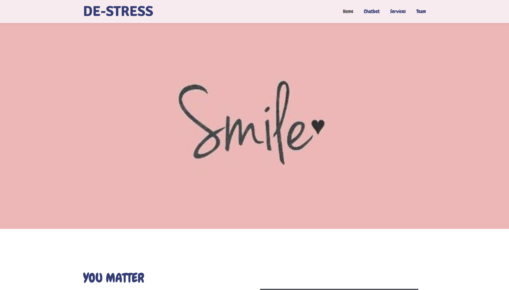
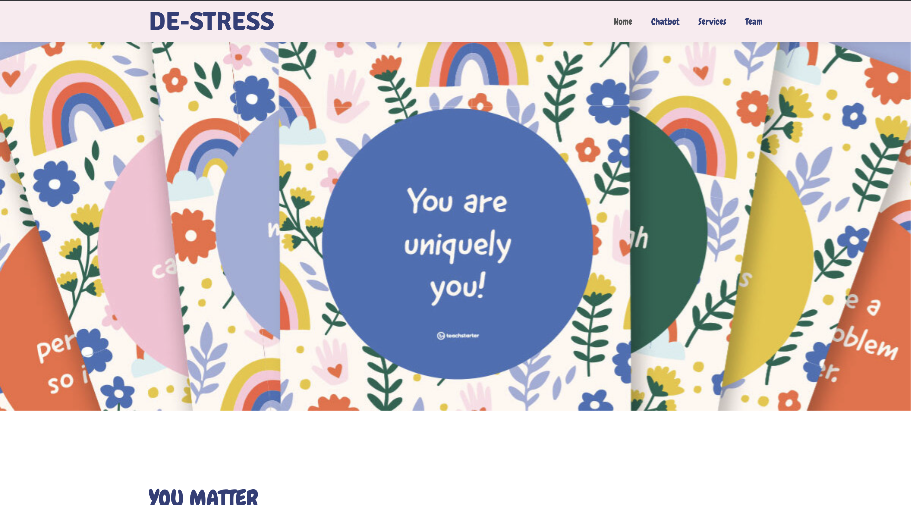
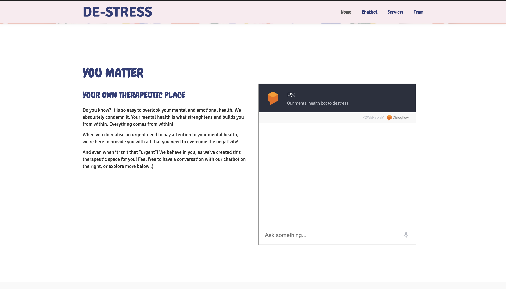
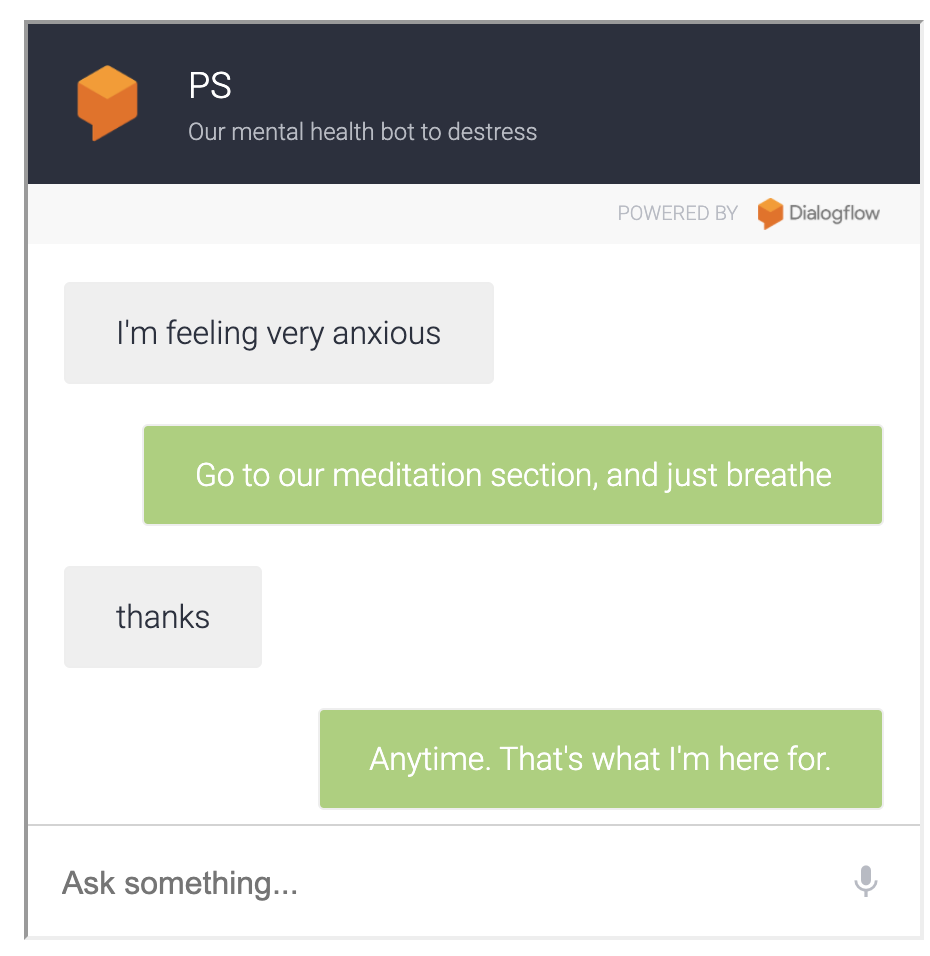
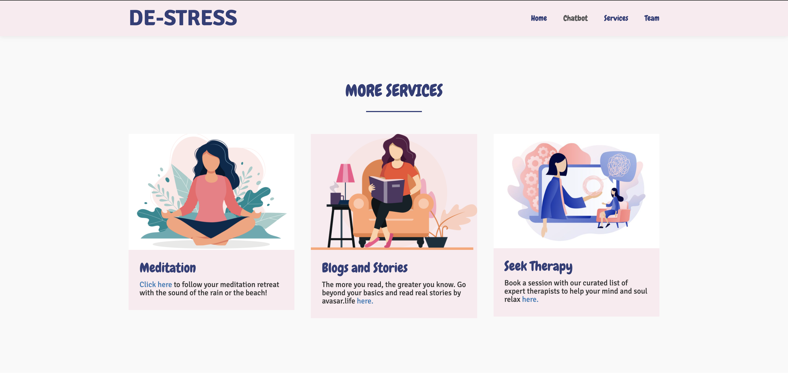
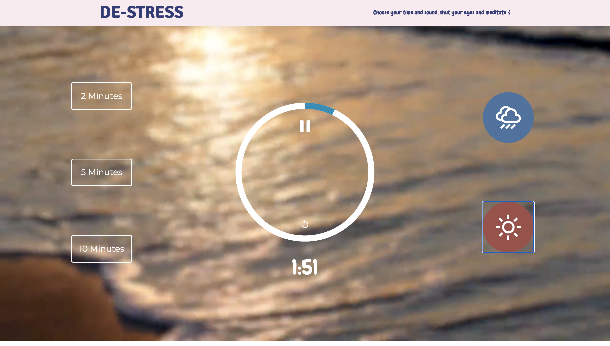
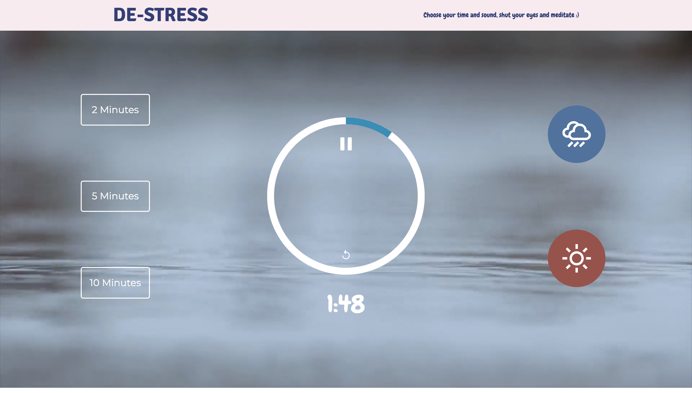
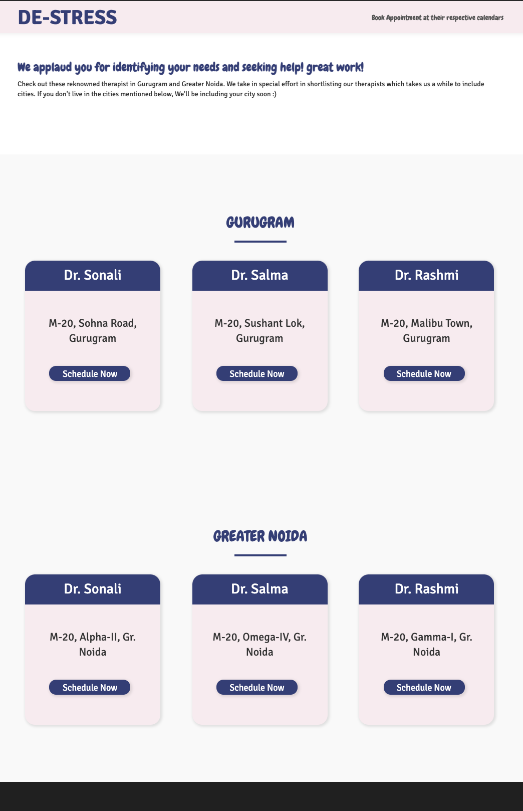

# One's own Therapeutic Place

Unfortunately we live in a world where people often overlook their mental health. We've built a therapeutic place for those people to come back, rejuvenate or seek help at!
We started by designing the UI, for which we chose soft and soothing colours, which are welcoming and calming! After the navbar we have added a carousel which shows positive affirmations and encouraging messages! We want to make this place truly therapeutic and induce a positive vibe as soon as the user arrives!

Following this, we welcome our users with a friend to talk to! We give them an encouraging start and a pal to talk to! this chatbot has been created using **DialogFlow** and has been trained to talk to people who maybe facing mental health issues in an encouraging and helpful manner. :)

A conversation may look like as follows: It maybe noted that it will not be the same every time and each conversation created more data to train on thereby improving the model!

Furthermore, the user is welcomed to the next section, where they can see and use the other features provided by us!

### Meditation Section
We have built a meditation section using HTML, CSS and Javascript where the user select their duration of meditation as well as the background they want and just ease into it with the beautiful meditative music curated to relax for the time they like!

### Blog Section
We have linked this section to stories by [avasar.life](avasar.life) in this section for our users to enjoy and grow with valuable content!

### Book Therapy Appointment
In our final section, we have given access to calendars of a curated list of therapists for appointment booking to our users looking for therapy.

## Techstack used-
* JavaScript
* HTML
* CSS
* Dialog Flow

## Team Ingenuity
* Shreyash Royzada
* Priyanshi Sharma
